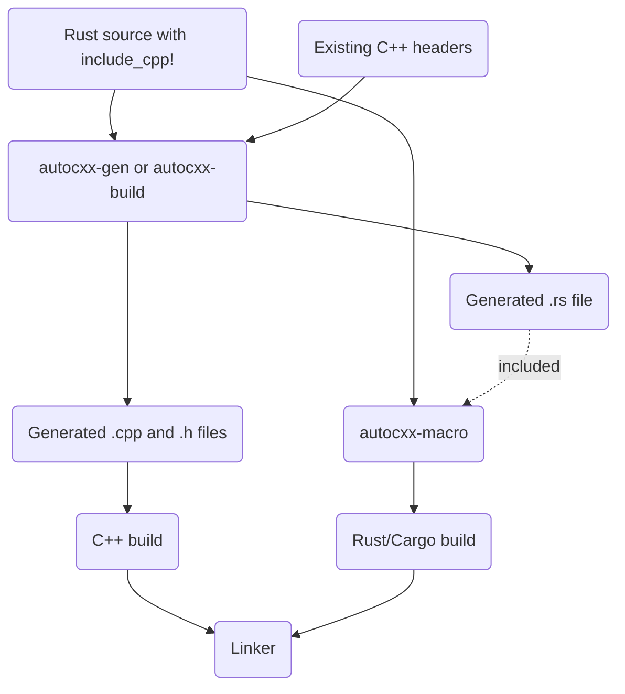

# Building

## Building if you're using cargo

The basics of building in a `cargo` environment are explained in [the tutorial](tutorial.md).

If your build depends on later editions of the C++ standard library, you will need to ensure that both `libclang` and the compiler are sent the appropriate flag, like this:

```rust,ignore
fn main() {
    let path = std::path::PathBuf::from("src"); // include path
    let mut b = autocxx_build::Builder::new("src/main.rs", &[&path])
        .extra_clang_args(&["-std=c++17"])
        .build()
        .unwrap();
    b.std("c++17") // cc picks the separator per compiler: `-std=c++17`, or `-std:c++17` for cl
        .compile("autocxx-demo"); // arbitrary library name, pick anything
    // Add instructions to link to any C++ libraries you need.
}
```

## Rebuilding

`autocxx-build` tells cargo to rerun your build script when the `.rs` file it
parsed changes, and when any header the C++ preprocessor opened while reading
it changes - which includes headers reached indirectly. You do not need to
name any of those yourself. Do name anything else your build script reads: the
`.cc` files you hand to `cc`, and any file you generate from.

Cargo stops scanning your package directory as a whole once a build script
names a single file, so a change to a file which neither you nor
`autocxx-build` names will not, by itself, rerun your build script. Cargo
still recompiles your Rust when your Rust changes; it is the C++ side of the
build which would go stale.

## Keeping `cxx` and `cxx-gen` level

`autocxx` writes the C++ half of each generated function using `cxx-gen`, while
the Rust half comes from the `cxx` crate your own crate depends on. Since cxx
1.0.189 the patch level of each is part of the symbol name they agree on, so
`cxx-gen` 0.7.199 and `cxx` 1.0.190 produce two halves which never meet and the
link fails naming a symbol you never wrote.

Both are ordinary version requirements which cargo resolves to the newest
release, so they agree unless something pins one and not the other - usually a
lockfile updated in one place. `cargo update -p cxx -p cxx-gen` puts them back
in step. `autocxx-build` reports the mismatch before generating anything, as
long as your crate depends on `cxx` directly (which it needs to anyway, since
the generated code names `::cxx`) and both crates come from a registry rather
than a `[patch]` or a vendor directory.

## Building - if you're not using cargo

See the `autocxx-gen` crate. You'll need to:

* Run the `codegen` phase. You'll need to use the [`autocxx-gen`](https://crates.io/crates/autocxx-gen)
  tool to process the .rs code into C++ header and
  implementation files. This will also generate `.rs` side bindings.
* Educate the procedural macro about where to find the generated `.rs` bindings. Set the
  `AUTOCXX_RS` environment variable to a list of directories to search.
  If you use `autocxx-build`, this happens automatically. (You can alternatively
  specify `AUTOCXX_RS_FILE` to give a precise filename as opposed to a directory to search,
  though this isn't recommended unless your build system specifically requires it
  because it allows only a single `include_cpp!` block per `.rs` file.) See `gen --help`
  for details on the naming of the generated files.



This interop inevitably involves lots of fiddly small functions. It's likely to perform far better if you can achieve cross-language link-time-optimization (LTO). [This issue](https://github.com/dtolnay/cxx/issues/371) may give some useful hints - see also all the build-related help in [the cxx manual](https://cxx.rs/) which all applies here too.

## C++ versions and other compiler command-line flags

Two standards are in play and they are set separately.

* **The standard your headers are parsed at.** `autocxx` reads your headers with `libclang`, at **C++17**. Raise or lower it with [`Builder::extra_clang_args`](https://docs.rs/autocxx-engine/latest/autocxx_engine/struct.Builder.html#method.extra_clang_args) — see [below](#if-your-headers-do-not-parse-as-c17).
* **The standard the generated code is compiled at.** That is your `cc::Build`'s business, and `autocxx` never sets it. The code `cxx` and `autocxx` generate requires **C++14**, so it's not possible to use an earlier version of C++ than that.

**Keep the two the same where you can.** A header read at one standard and compiled at another can differ in more than `#if __cplusplus >= 201703L`, where a declaration `autocxx` generated a binding for may simply not be there at compile time. The quieter cases need no conditional compilation at all, because C++17 changed rules the header is already written against:

* Overload resolution. `noexcept` is part of a function's type from C++17, so taking the address of a `noexcept` function picks a different overload than it did — and if the result feeds a constant expression, a value `autocxx` recorded from the parse may not be the value the compiler computes.
* Constant evaluation. Guaranteed copy elision means `noexcept(noexcept(T(T{})))` can be false at C++14 and true at C++17, so a method's own exception specification can differ between the two.

Most builds are unaffected. `autocxx` parsed at C++14 while compilers have defaulted to later standards for years, so the two have rarely agreed on their own; C++17 makes them agree for anyone whose compiler defaults to C++17, and narrows the gap for everyone else. Compiler defaults move, though, so set both sides explicitly if it matters to you — that is the only way to know they agree.

The parse standard is C++17 because that is the first standard in which a function's exception specification is part of its type. Only there can `autocxx` tell `noexcept(false)` from `noexcept(true)`, which it needs in order to reproduce a superclass method's specification on a [subclass](rust_calls.md) override rather than refuse it.

To compile the generated code at a later version, you need to:

* Build the generated code with a later C++ version. If you're using autocxx's cargo support, then you would do this by calling [`std`](https://docs.rs/cc/latest/cc/struct.Build.html#method.std) on the returned `cc::Build` object — `b.std("c++17")` — which names the standard and lets `cc` pick the separator the compiler it chose wants: `-std=c++17` for gcc and clang, `-std:c++17` for cl (which takes `-` for `/`). Prefer it to passing the flag yourself with [`flag_if_supported`](https://docs.rs/cc/latest/cc/struct.Build.html#method.flag_if_supported), which hard-codes one compiler's spelling and, wherever that spelling is not the one the compiler wants, is dropped without a word — leaving whatever standard the build would otherwise have used. Note that `cc` emits the `std` flag *before* the `CXXFLAGS` from your environment, and a flag you pass yourself *after* them; so for gcc and clang a `-std=` in `CXXFLAGS` overrides `std`, and whichever of the two ends up in force is the one that has to agree with `extra_clang_args` below. (For cl it takes a `/std:` or `-std:` there to have that effect; a `-std=` is not an option cl recognises.)
* _Also_ give similar directives to the C++ parsing which happens _within_ autocxx (specifically, by autocxx's version of bindgen). To do that, use [`Builder::extra_clang_args`](https://docs.rs/autocxx-engine/latest/autocxx_engine/struct.Builder.html#method.extra_clang_args). Calls to it accumulate in call order, so a `build.rs` which assembles its builder out of several helpers keeps each helper's flags; what a repeated option then means is clang's to decide, and it takes the last `-std=`.

The same applies with the command-line `autocxx_gen` support - you'll need to pass such extra compiler options to `autocxx_gen` and also use them when building the generated C++ code.

### If your headers do not parse as C++17

Most headers written for an older standard parse as C++17 unchanged. C++17 deleted a few things, and clang reports three of them as errors by default, which would stop `autocxx` reading the header at all. `autocxx` demotes each to a warning — you will still see it — so that a header containing one is still read: dynamic exception specifications (`void f() throw(int)`), the `register` storage class, and incrementing a `bool`. Pass `-Werror=dynamic-exception-spec`, `-Werror=register` or `-Werror=increment-bool` in `extra_clang_args` to have any of them back as an error, since your arguments come after `autocxx`'s.

What `autocxx` does *not* do is change which declarations the parse sees, so a standard library facility C++17 removed is genuinely gone: `std::auto_ptr` is the one most likely to come up, and on some standard libraries no macro brings it back. A header which needs one of those has to be parsed at an older standard:

```rust,ignore
let mut b = autocxx_build::Builder::new("src/main.rs", &[&path])
    .extra_clang_args(&["-std=c++14"])
    .build()
    .unwrap();
b.std("c++14").compile("autocxx-demo");
```

`autocxx` puts its own `-std=` first and yours after it, and clang obeys the last one, so that is all it takes. (`BINDGEN_EXTRA_CLANG_ARGS` lands after both and overrides both.) The cost is that `autocxx` can no longer tell which way a `noexcept(expr)` resolved, so a subclass override of a method declared with one is refused — the behaviour before the parse standard was C++17.
