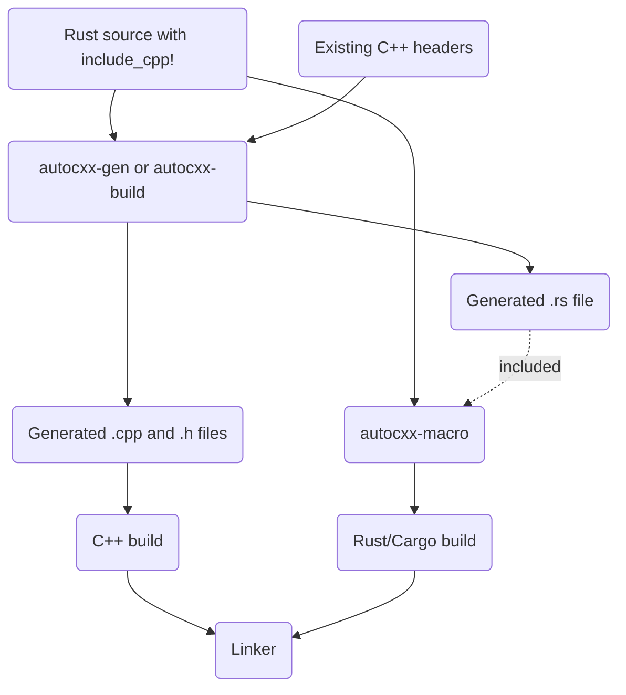

# Building

## Building if you're using cargo

The basics of building in a `cargo` environment are explained in [the tutorial](tutorial.md).

If your build depends on later editions of the C++ standard library, you will need to ensure that both `libclang` and the compiler are sent the appropriate flag, like this:

```rust,ignore
fn main() {
    let path = std::path::PathBuf::from("src"); // include path
    let mut b = autocxx_build::Builder::new("src/main.rs", &[&path])
        .extra_clang_args(&["-std=c++17"])
        .build()
        .unwrap();
    b.std("c++17") // cc picks the separator per compiler: `-std=c++17`, or `-std:c++17` for cl
        .compile("autocxx-demo"); // arbitrary library name, pick anything
    println!("cargo:rerun-if-changed=src/main.rs");
    // Add instructions to link to any C++ libraries you need.
}
```

## Keeping `cxx` and `cxx-gen` level

`autocxx` writes the C++ half of each generated function using `cxx-gen`, while
the Rust half comes from the `cxx` crate your own crate depends on. Since cxx
1.0.189 the patch level of each is part of the symbol name they agree on, so
`cxx-gen` 0.7.199 and `cxx` 1.0.190 produce two halves which never meet and the
link fails naming a symbol you never wrote.

Both are ordinary version requirements which cargo resolves to the newest
release, so they agree unless something pins one and not the other - usually a
lockfile updated in one place. `cargo update -p cxx -p cxx-gen` puts them back
in step. `autocxx-build` reports the mismatch before generating anything, as
long as your crate depends on `cxx` directly (which it needs to anyway, since
the generated code names `::cxx`) and both crates come from a registry rather
than a `[patch]` or a vendor directory.

## Building - if you're not using cargo

See the `autocxx-gen` crate. You'll need to:

* Run the `codegen` phase. You'll need to use the [`autocxx-gen`](https://crates.io/crates/autocxx-gen)
  tool to process the .rs code into C++ header and
  implementation files. This will also generate `.rs` side bindings.
* Educate the procedural macro about where to find the generated `.rs` bindings. Set the
  `AUTOCXX_RS` environment variable to a list of directories to search.
  If you use `autocxx-build`, this happens automatically. (You can alternatively
  specify `AUTOCXX_RS_FILE` to give a precise filename as opposed to a directory to search,
  though this isn't recommended unless your build system specifically requires it
  because it allows only a single `include_cpp!` block per `.rs` file.) See `gen --help`
  for details on the naming of the generated files.



This interop inevitably involves lots of fiddly small functions. It's likely to perform far better if you can achieve cross-language link-time-optimization (LTO). [This issue](https://github.com/dtolnay/cxx/issues/371) may give some useful hints - see also all the build-related help in [the cxx manual](https://cxx.rs/) which all applies here too.

## C++ versions and other compiler command-line flags

The code generated by cxx and autocxx requires C++ 14, so it's not possible to use an earlier version of C++ than that.

To use a later version, you need to:

* Build the generated code with a later C++ version. If you're using autocxx's cargo support, then you would do this by calling [`std`](https://docs.rs/cc/latest/cc/struct.Build.html#method.std) on the returned `cc::Build` object — `b.std("c++17")` — which names the standard and lets `cc` pick the separator the compiler it chose wants: `-std=c++17` for gcc and clang, `-std:c++17` for cl (which takes `-` for `/`). Prefer it to passing the flag yourself with [`flag_if_supported`](https://docs.rs/cc/latest/cc/struct.Build.html#method.flag_if_supported), which hard-codes one compiler's spelling and, wherever that spelling is not the one the compiler wants, is dropped without a word — leaving whatever standard the build would otherwise have used. Note that `cc` emits the `std` flag *before* the `CXXFLAGS` from your environment, and a flag you pass yourself *after* them; so for gcc and clang a `-std=` in `CXXFLAGS` overrides `std`, and whichever of the two ends up in force is the one that has to agree with `extra_clang_args` below. (For cl it takes a `/std:` or `-std:` there to have that effect; a `-std=` is not an option cl recognises.)
* _Also_ give similar directives to the C++ parsing which happens _within_ autocxx (specifically, by autocxx's version of bindgen). To do that, use [`Builder::extra_clang_args`](https://docs.rs/autocxx-engine/latest/autocxx_engine/struct.Builder.html#method.extra_clang_args). Calls to it accumulate in call order, so a `build.rs` which assembles its builder out of several helpers keeps each helper's flags; what a repeated option then means is clang's to decide, and it takes the last `-std=`.

The same applies with the command-line `autocxx_gen` support - you'll need to pass such extra compiler options to `autocxx_gen` and also use them when building the generated C++ code.
